# 11ty Demos

**Live: [11ty-demos.netlify.app](https://11ty-demos.netlify.app/)**

A single Eleventy site that hosts many independent Eleventy implementation patterns as standalone demo pages — instead of one repo per pattern. Every demo is real and wired into the site itself: the _Dark Mode_ demo is the site's actual theme toggle, the _Search_ demo is the header search bar, and so on.

## Quick start

```bash
npm install
npm start      # dev server at http://localhost:3000
npm run build  # eleventy build + pagefind indexing, output to public/
npm run lint    # ESLint over eleventy.config.js, src/_11ty/, src/_data/, src/assets/js/, netlify/functions/
npm run format  # Prettier --write over js/scss/json/md (not .njk — see prettier.config.js)
```

## Architecture

```mermaid
graph TD
    Config["eleventy.config.js<br/><i>thin orchestrator</i>"] --> Src["src/"]
    Config --> Netlify["netlify/functions/views.js<br/><i>backs the View Counter demo</i>"]

    Src --> Eleventy11ty["_11ty/"]
    Eleventy11ty --> Glob["registerFromGlob.js<br/><i>scans a folder, registers each file by filename</i>"]
    Eleventy11ty --> Filters["filters/<br/><i>readableDate.js, toc.js, ...</i>"]
    Eleventy11ty --> Shortcodes["shortcodes/<br/><i>codeFile.js, image.js</i>"]
    Eleventy11ty --> Collections["collections/<br/><i>demos.js, demoTags.js, posts.js</i>"]
    Eleventy11ty --> Transforms["transforms/<br/><i>htmlmin.js</i>"]
    Eleventy11ty --> Sass["sass.js<br/><i>Sass via Eleventy's addExtension API</i>"]

    Src --> Data["_data/"]
    Data --> Site["site.js<br/><i>sitewide metadata</i>"]
    Data --> DemoData["lighthouse.js, multiFormatImageDemo.js,<br/>responsiveImageDemo.js<br/><i>precomputed data for specific demos</i>"]

    Src --> Includes["_includes/"]
    Includes --> Layouts["layouts/<br/><i>base → page / demo / blog-post</i>"]
    Includes --> Components["components/<br/><i>header, footer, nav, theme-toggle, search-bar,<br/>demo-card, tag-list, difficulty-badge, breadcrumbs, pagination-nav</i>"]
    Includes --> DemoLive["demo-live/<br/><i>one real partial per demo's Live Implementation</i>"]

    Src --> Demos["demos/"]
    Demos --> DemosJson["demos.json<br/><i>layout, base tag, permalink</i>"]
    Demos --> DemosMd["*.md — one demo per file"]

    Src --> Blog["blog/"]
    Blog --> BlogJson["blog.json<br/><i>same pattern as demos.json</i>"]
    Blog --> BlogMd["*.md"]

    Src --> Assets["assets/"]
    Assets --> Scss["scss/<br/><i>abstracts / base / layout / components / pages</i>"]
    Assets --> Js["js/<br/><i>main.js, search.js, toc.js, view-counter.js — no framework, no bundler</i>"]
    Assets --> Images["images/demos/<br/><i>one thumbnail SVG per demo</i>"]

    Src --> TopLevel["index.njk, about.md, demos.njk, tags.njk,<br/>blog.njk, feed.njk, search-index.njk"]
```



## Adding a new demo

Drop a Markdown file into `src/demos/`:

```yaml
---
title: "Your Demo Title"
description: "One sentence describing what this demo actually does."
tags: ["some-tag", "another-tag"]
date: 2026-08-01
difficulty: "Intermediate"   # Beginner | Intermediate | Advanced
thumbnail: /assets/images/demos/your-demo-title.svg
order: 90                     # optional; controls listing/prev-next order
demoBlock: "demo-live/your-demo-title.njk"   # optional; a real, working live example
---

## How It Works
...
## Folder Structure
...
## Important Files

## Notes
...
```

That's the entire contract. The new demo automatically:

- Gets the shared hero/layout (`src/demos/demos.json` sets the default `layout` and computed permalink `/demos/<slug>/`).
- Appears on `/demos/` (the listing loops the `demos` collection).
- Gets a `/demos/tags/<tag>/` page for each of its tags.
- Is included in `/search-index.json` → the header search.
- Slots into Previous/Next navigation, ordered by `order` (or title).
- Can show up in other demos' "Related Demos" sections via shared tags.

No other file needs to change.

The same "just add a file" idea applies to the build config itself: a new filter, shortcode, or collection is a single default-exported function under `src/_11ty/filters/`, `src/_11ty/shortcodes/`, or `src/_11ty/collections/` — `registerFromGlob` picks it up by filename, nothing to register in `eleventy.config.js`.

## What's built

Dark Mode, Multi-level Navigation, Tags, Syntax Highlighting, Table of Contents, Search, RSS, Breadcrumbs, Pagination, Collections, Contact Form, Responsive Images, Pagefind Search, Multi-format Images, Live Lighthouse Scores, Reading Time, Live View Counter, Image Gallery, Masonry Gallery, Data Files, Custom Filters, Shortcodes, Print Stylesheet, Copy Code Button, Accessibility, Sitemap, 404 Page, Schema.org / JSON-LD, Unit Tests — plus the whole architecture (collections, listing, tag pages, search, prev/next, SCSS system, blog scaffold).

Also worth knowing: `npm test` runs a real Node test suite (`test/filters.test.js`) covering the pure filters, gating every pull request via GitHub Actions.

That's every demo from the original list. Anything past this is a new addition, not a gap — the recipe under "Adding a new demo" above is still all that's needed.

## Deployment

Configured for Netlify (`netlify.toml`: `npm run build`, publish `public`). No `pathPrefix` is set since Netlify serves from the domain root.
